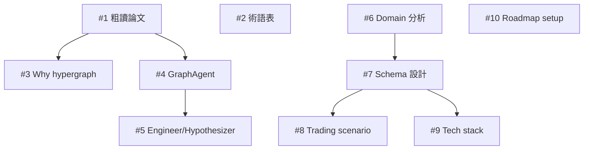

# 專案結構與 Roadmap

## Epics

### E1 - MIT Hypergraph 論文解構
**目標**：深入理解 MIT 的 hypergraph + multi-agent 架構

- M1: 快速通讀 + 高層筆記
- M2: Hypergraph 知識表示 + 推理
- M3: 三智能體架構分析

### E2 - 個人知識庫設計映射
**目標**：將 MIT 模式映射到個人 domain

- M1: 個人 domain 分析
- M2: Hypergraph schema 設計
- M3: 三智能體角色映射

### E3 - 最小原型實作
**目標**：可運行的 hypergraph storage + ingestion

- M1: 儲存層
- M2: LLM-assisted 超邊抽取
- M3: 簡單查詢與視覺化

### E4 - 三智能體系統
**目標**：GraphAgent / Engineer / Hypothesizer 個人版

- M1: GraphAgent
- M2: Engineer
- M3: Hypothesizer

---

## Issue Dependency Graph

---

## 當前狀態

- **Phase**: Research & Design
- **Current Sprint**: E1-M1（論文理解）
- **Next**: E1-M3 + E2-M1 平行進行